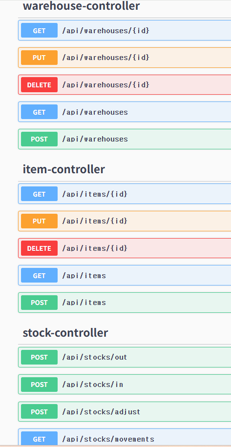
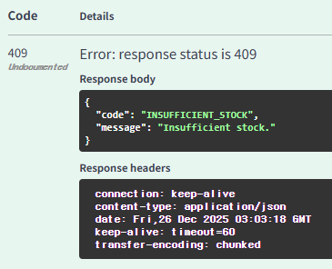
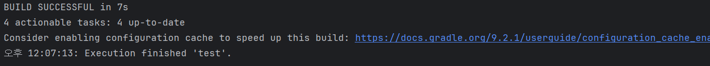

# Inventory API (v1.0.0)

Spring Boot 기반 재고 관리 REST API 프로젝트.  
입고/출고/조정 트랜잭션과 **현재 재고(StockBalance) + 변동 이력(StockMovement)** 분리 설계를 중심으로 구현했다.

## Tech Stack
- Java 17
- Spring Boot
- Spring Data JPA
- H2 (dev/test)
- Gradle
- Swagger (springdoc-openapi)

## Core Features (v1.0.0)
- Item CRUD
- Warehouse CRUD
- Stock
    - IN(입고), OUT(출고), ADJUST(조정)
    - 재고 부족 시 `409 Conflict (INSUFFICIENT_STOCK)`
    - 변동 이력 조회 (`GET /api/stocks/movements`)

## Domain Design (Why)
### 1) StockBalance vs StockMovement 분리
- **StockBalance**: (item, warehouse) 조합별 “현재 수량”을 1행으로 관리
    - `(item_id, warehouse_id)` 유니크 제약으로 중복 방지
- **StockMovement**: 입고/출고/조정 “이력”을 누적 저장
    - 감사/추적/집계에 유리

### 2) Movement.quantity는 ‘부호 포함 변화량’
- IN: `+N`
- OUT: `-N`
- ADJUST: `+/-N`

### 3) 트랜잭션 & 예외 정책
- 출고/조정 시 재고 부족이면 `409 Conflict` 반환
- 실패 요청은 DB에 반영되지 않도록 트랜잭션으로 보장

## API (Swagger)
Swagger UI: `http://localhost:8080/swagger-ui/index.html`

### Stock
- `POST /api/stocks/in`
- `POST /api/stocks/out`
- `POST /api/stocks/adjust`
- `GET /api/stocks/movements?itemId={id}&warehouseId={id}`

### Request Examples

#### 입고
```json
{"itemId":1,"warehouseId":1,"quantity":10}
```
#### 출고
```json
{"itemId":1,"warehouseId":1,"quantity":3}
```
#### 조정(+/-)
```json
{"itemId":1,"warehouseId":1,"quantity":-2}
```
#### Response Example (movements)
```json
[
  {"type":"ADJUST","quantity":-2},
  {"type":"OUT","quantity":-3},
  {"type":"IN","quantity":10}
]
```
#### Error Example (insufficient stock)
```json
{"code":"INSUFFICIENT_STOCK","message":"Insufficient stock."}
```
---

#### How to Run
```bash
./gradlew bootRun
```
#### Tests
```bash
./gradlew test
```
### Roadmap (Next)
- 현재 재고 조회 API (StockBalance 조회)
- movements 페이징/정렬
- 인증/권한(관리자/사용자)

## Screenshots

### Swagger API



### Tests



---

# Inventory API (v1.0.0) - 日本語

Spring Boot で実装した在庫管理 REST API。  
入庫/出庫/調整のトランザクションと、**現在在庫(StockBalance) + 変更履歴(StockMovement)** を分離した設計を中心に実装しました。

## 技術スタック
- Java 17
- Spring Boot
- Spring Data JPA
- H2 (dev/test)
- Gradle
- Swagger (springdoc-openapi)

## 主な機能 (v1.0.0)
- Item CRUD
- Warehouse CRUD
- 在庫
    - IN(入庫), OUT(出庫), ADJUST(調整)
    - 在庫不足の場合 `409 Conflict (INSUFFICIENT_STOCK)`
    - 変更履歴の取得 (`GET /api/stocks/movements`)

## 設計ポイント (Why)
### 1) StockBalance と StockMovement の分離
- **StockBalance**: (item, warehouse) ごとの「現在数量」を1行で管理（重複防止のためユニーク制約）
- **StockMovement**: 入庫/出庫/調整の履歴を蓄積し、監査・追跡・集計をしやすくする

### 2) Movement.quantity は「符号付き差分」
- IN: `+N`
- OUT: `-N`
- ADJUST: `+/-N`

### 3) トランザクション & 例外方針
- 在庫不足は `409 Conflict` を返す
- 失敗したリクエストは DB に反映されない（トランザクションで保証）

## API (Swagger)
Swagger UI: `http://localhost:8080/swagger-ui/index.html`

### Stock
- `POST /api/stocks/in`
- `POST /api/stocks/out`
- `POST /api/stocks/adjust`
- `GET /api/stocks/movements?itemId={id}&warehouseId={id}`

### リクエスト例

#### 入庫
```json
{"itemId":1,"warehouseId":1,"quantity":10}
```
#### 出庫
```json
{"itemId":1,"warehouseId":1,"quantity":3}
```
#### 調整(+/-)
```json
{"itemId":1,"warehouseId":1,"quantity":-2}
```
#### レスポンス例 (movements)
```json
[
  {"type":"ADJUST","quantity":-2},
  {"type":"OUT","quantity":-3},
  {"type":"IN","quantity":10}
]
```
#### エラー例 (在庫不足)
```json
{"code":"INSUFFICIENT_STOCK","message":"Insufficient stock."}
```
---

#### How to Run
```bash
./gradlew bootRun
```
#### Tests
```bash
./gradlew test
```
### 今後の予定（Roadmap）
- 現在在庫の取得 API（StockBalance 조회）
- 在庫履歴のページング・ソート
- 認証／権限管理（管理者・ユーザー）

## Screenshots

### Swagger API


### Tests


---


